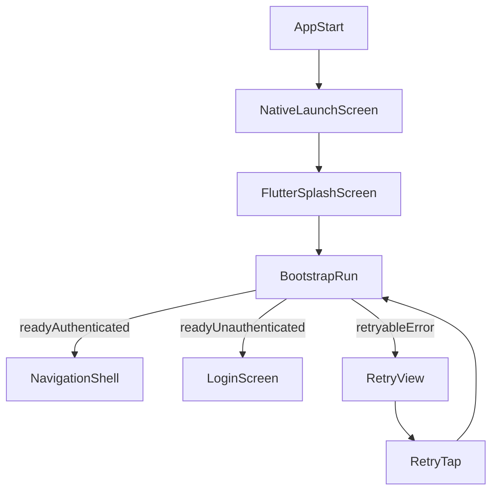
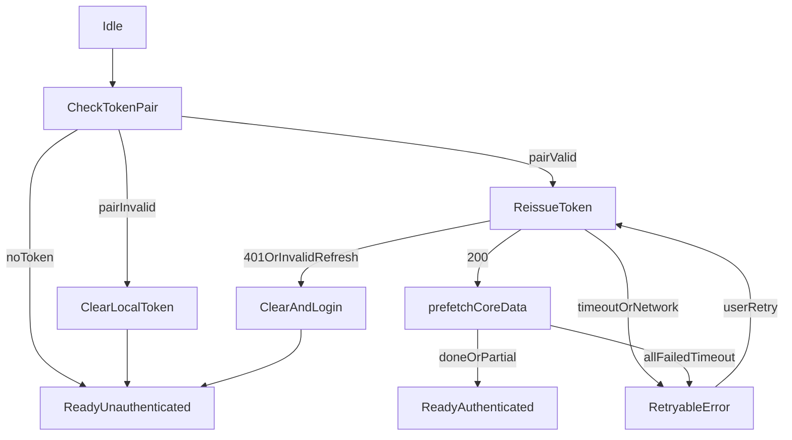

# Splash Bootstrap 설계서

## 1) 배경, 목표, 비목표

### 배경
- 현재 앱은 콜드 스타트 시 스플래시를 노출하지만, 실제 인증 검증은 로컬 토큰 유무 확인 중심이다.
- `AuthStatus` 전환이 빠르면 초기 화면 전환이 급격해질 수 있고, 홈/캘린더의 첫 API 로딩이 진입 후 발생한다.
- 참고 코드:
  - 앱 부팅/라우팅: [lib/main.dart](lib/main.dart)
  - 인증 상태 판정: [lib/controllers/auth_controller.dart](lib/controllers/auth_controller.dart)
  - 토큰 재발급: [lib/services/auth_service.dart](lib/services/auth_service.dart)
  - 401 인터셉터: [lib/core/network/api_client.dart](lib/core/network/api_client.dart)

### 목표
- 스플래시 구간에서 서버 기준 세션 유효성을 검증한다.
- 세션 유효 시 메인 진입에 필요한 핵심 데이터를 선요청(prefetch)한다.
- 네트워크 지연/오류 시 무한 로딩 대신 재시도 가능한 상태를 제공한다.

### 비목표
- 스플래시 단계에서 모든 화면 데이터를 완전 동기화하지 않는다.
- 기존 딥링크 소비 주체를 `NavigationShell`에서 스플래시로 옮기지 않는다.
- 인증 정책 자체(JWT 구조, OAuth 흐름)를 변경하지 않는다.

---

## 2) 사용자 진입 흐름



설명:
- 콜드 스타트에서만 스플래시를 실행한다.
- `resume`(백그라운드 복귀)에서는 스플래시를 다시 띄우지 않는다.
- 현재 최소 노출 시간(1.5초) 정책은 유지한다([lib/main.dart](lib/main.dart)).

---

## 3) 부트스트랩 상태 머신



상태 정의:
- `CheckTokenPair`: access/refresh 토큰 존재 + 쌍 유효성 확인.
- `ReissueToken`: `/api/auth/reissue` 호출로 서버 기준 세션 검증.
- `prefetchCoreData`: 메인 첫 화면용 핵심 API 선요청.
- `RetryableError`: 네트워크 지연/오류로 재시도 UI 노출.

---

## 4) 케이스별 라우팅 규칙

1. access/refresh 모두 없음  
   - 즉시 `readyUnauthenticated` → 로그인 화면.

2. 토큰 쌍 불일치(access만 존재 또는 refresh만 존재)  
   - 로컬 토큰 clear 후 로그인 화면.

3. 재발급 성공(200)  
   - `prefetchCoreData` 실행.
   - 선요청 완료 또는 부분 실패 허용 후 메인(`NavigationShell`) 진입.

4. 재발급 실패(401/invalid refresh)  
   - 로컬 토큰 clear 후 로그인 화면.

5. 재발급 타임아웃/네트워크 오류  
   - `RetryableError` 화면 노출.
   - 버튼: `다시 시도`.

6. 선요청 중 일부 실패  
   - 실패 항목은 화면 진입 후 개별 provider 재요청.
   - 전체 블로킹하지 않고 메인 진입 허용(표준 정책).

---

## 5) 백엔드 API 계약

### 5.1 인증 재발급 (기존)

- Endpoint: `POST /api/auth/reissue`
- Request:

```json
{
  "refreshToken": "string"
}
```

- Success(200):

```json
{
  "accessToken": "string",
  "refreshToken": "string (optional, rotation)"
}
```

- Failure:
  - `401`: invalid/expired refresh token
  - `5xx`: 서버 오류

관련 클라이언트:
- [lib/services/auth_service.dart](lib/services/auth_service.dart)
- [lib/core/network/api_client.dart](lib/core/network/api_client.dart)

### 5.2 선요청 범위(standard)

#### A. 홈 데이터
- Endpoint: `GET /page/home?todayDate=yyyy-MM-dd`
- 목적: 홈 첫 렌더 데이터 확보
- 관련 코드:
  - [lib/controllers/home_controller.dart](lib/controllers/home_controller.dart)
  - [lib/datasources/remote/home_remote_datasource.dart](lib/datasources/remote/home_remote_datasource.dart)

#### B. 현재 월 일정
- Endpoint: `GET /page/schedules/search?startDate=yyyy-MM-dd&endDate=yyyy-MM-dd`
- 목적: 캘린더 첫 진입 시 월 이벤트 즉시 렌더
- 관련 코드:
  - [lib/controllers/calendar_controller.dart](lib/controllers/calendar_controller.dart)
  - [lib/services/schedule_api_client.dart](lib/services/schedule_api_client.dart)

### 5.3 향후 확장(옵션)

#### C. 경량 사용자 웜업(제안)
- Endpoint: `GET /users/me`
- 목적: 닉네임/프로필 등 최소 사용자 메타를 서버 기준으로 선확보

#### D. 앱 컨피그(제안)
- Endpoint: `GET /app/config?platform=ios|android`
- 목적: 강제 업데이트/점검 모드/공지 ID 처리

예시 응답:

```json
{
  "minSupportedVersion": "1.4.0",
  "latestVersion": "1.6.0",
  "maintenance": {
    "enabled": false,
    "message": null,
    "resumeAt": null
  },
  "noticeId": "2026-04-launch"
}
```

---

## 6) 타임아웃, 재시도, 부분실패 허용 정책

### 타임아웃
- 재발급 요청: 3~5초
- 선요청 API 개별: 2~4초
- 부트스트랩 전체 상한: 8초

### 재시도
- 자동 재시도: 0~1회(권장 1회)
- 수동 재시도: `RetryableError`에서 버튼 탭 시 전체 bootstrap 재실행

### 부분 실패 허용
- 표준 선요청(홈 + 캘린더)에서 일부 실패 시 메인 진입 허용.
- 실패 API는 각 화면/provider에서 진입 후 재요청.

### 무한 로딩 방지
- 상태 머신 기반 전환으로 `loading` 고착을 차단.
- `isBootstrapping` 단일 실행 락으로 중복 호출 방지.

---

## 7) 선요청 범위(standard)와 캐시 주입 원칙

### 선요청 대상(확정)
- 홈: `/page/home`
- 캘린더(현재월): `/page/schedules/search`

### 캐시 주입 원칙
- 선요청 결과를 화면 진입 후 바로 사용할 수 있는 저장소(provider cache)에 주입.
- 동일 요청 중복 방지:
  - 스플래시에서 요청 중이면 화면 진입 직후 동일 API 즉시 재호출 금지.
  - TTL(예: 30~60초) 내 재진입 시 캐시 우선.

### 딥링크/푸시와의 순서
- 스플래시는 인증+핵심 데이터 준비까지만 담당.
- 딥링크 소비는 기존처럼 `NavigationShell`이 담당([lib/views/screens/navigation_shell.dart](lib/views/screens/navigation_shell.dart)).

---

## 8) 에러 코드 매핑 표준

| 구분 | 조건 | 클라이언트 처리 |
|---|---|---|
| 토큰 없음 | access/refresh 모두 없음 | 로그인 화면 이동 |
| 토큰 쌍 불일치 | access만 또는 refresh만 있음 | 토큰 clear 후 로그인 |
| 재발급 성공 | 200 | 선요청 실행 후 메인 이동 |
| 재발급 인증 실패 | 401 / invalid refresh | 토큰 clear 후 로그인 |
| 재발급 네트워크 오류 | timeout / connection error | RetryableError 노출 |
| 선요청 일부 실패 | 일부 API 실패 | 메인 이동 + 실패 API 지연 재요청 |
| 선요청 전체 실패 | 모든 API 실패 + 재시도 소진 | RetryableError 노출 |

에러 응답 표준(백엔드 협의 제안):

```json
{
  "code": "AUTH_INVALID_REFRESH",
  "message": "Refresh token is invalid or expired",
  "timestamp": "2026-04-20T12:00:00Z"
}
```

---

## 9) 로깅, 관측성, 보안 체크

### 로깅
- 권장 로그 포맷:
  - `[BOOT] checkTokenPair_start/end`
  - `[BOOT] reissue_start/end status=...`
  - `[BOOT] prefetch_home_start/end`
  - `[BOOT] prefetch_calendar_start/end`
  - `[BOOT] bootstrap_end result=... elapsedMs=...`

### 관측성
- 지표:
  - bootstrap 총 소요 시간 p50/p95
  - retryable error 발생률
  - 재발급 실패율(401 비율 포함)
  - 선요청 부분 실패율

### 보안
- 토큰 원문 로그 금지(마스킹 유지).
- refresh token은 body 전송만 허용.
- TLS(HTTPS) 필수.

---

## 10) 테스트 시나리오 및 롤아웃 계획

### 테스트 시나리오
1. 토큰 없음 → 로그인 이동
2. 토큰 쌍 불일치 → clear 후 로그인
3. 재발급 200 + 선요청 성공 → 메인 즉시 렌더
4. 재발급 401 → clear 후 로그인
5. 재발급 timeout → RetryableError, 수동 재시도 성공
6. 선요청 부분 실패 → 메인 진입 + 실패 화면에서 재요청
7. 콜드 스타트 + 푸시 딥링크 → bootstrap 후 `NavigationShell`에서 딥링크 소비
8. 콜드 스타트 + 공유 인텐트 → bootstrap 후 공유 처리 정상 동작

### 롤아웃
- Phase 1: 내부 QA(디버그 로그 기반)
- Phase 2: 사내 베타(bootstrap 지표 모니터링)
- Phase 3: 전체 배포
- 롤백 조건:
  - retryable error 급증
  - bootstrap p95 악화
  - 로그인 전환 오류 증가

---

## 11) 백엔드 협의 체크리스트

1. `/api/auth/reissue` 실패 코드 규약 확정(401 기준 포함)
2. refresh rotation 응답 필드 정책 확정(`refreshToken` optional 여부)
3. 선요청 대상 API의 타임아웃/부하 허용치 합의
4. 오류 응답 바디 표준(`code`, `message`, `timestamp`) 합의
5. (선택) `/users/me` 도입 여부
6. (선택) `/app/config` 도입 여부 및 캐시 정책
7. 운영 시 모니터링 지표와 알람 임계치 합의

---

## 부록) 현재 코드 기준 참조 파일

- 부팅/라우팅: [lib/main.dart](lib/main.dart)
- 인증 상태/복구: [lib/controllers/auth_controller.dart](lib/controllers/auth_controller.dart)
- 토큰 재발급: [lib/services/auth_service.dart](lib/services/auth_service.dart)
- 인증 인터셉터(single-flight): [lib/core/network/api_client.dart](lib/core/network/api_client.dart)
- 스플래시 UI: [lib/views/screens/splash_screen.dart](lib/views/screens/splash_screen.dart)
- 홈 데이터 로드: [lib/controllers/home_controller.dart](lib/controllers/home_controller.dart)
- 홈 원격 데이터소스: [lib/datasources/remote/home_remote_datasource.dart](lib/datasources/remote/home_remote_datasource.dart)
- 캘린더 로드: [lib/controllers/calendar_controller.dart](lib/controllers/calendar_controller.dart)
- 일정 API 클라이언트: [lib/services/schedule_api_client.dart](lib/services/schedule_api_client.dart)
- 딥링크/공유 소비: [lib/views/screens/navigation_shell.dart](lib/views/screens/navigation_shell.dart)
